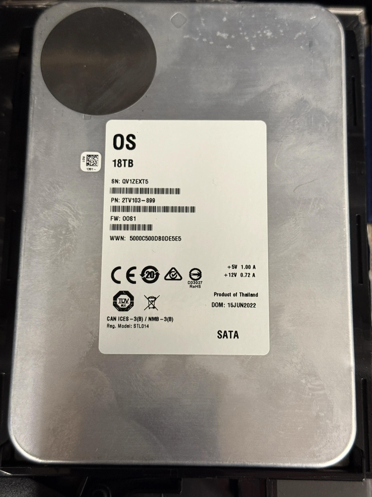

OOS18000G | 18 TB | 7,200 rpm | Serial: 0001HR2B
Power-on hours: 4,433 | SMART self-assessment: PASSED
Known failing (operator report); disclose as failing
ATA errors: 155 | UDMA CRC: 127 | Command timeouts: 2
Reallocated: 0 | Pending: 0 | Offline uncorrectable: 0
Physical label: QV1ZEXT5; DOM: 15 Jun 2022
Removed from slot 2 after it began failing. The captured SMART report lists
serial 0001HR2B, while the physical label reads QV1ZEXT5.



**Full captured report*** (command: `smartctl -a -d sat /dev/sdb`; preserving the complete output supplied):

```text
smartctl 6.5 (build date Mar  2 2021) [x86_64-linux-4.4.59+] (local build)
Copyright (C) 2002-16, Bruce Allen, Christian Franke, www.smartmontools.org

=== START OF INFORMATION SECTION ===
Device Model:     OOS18000G
Serial Number:    0001HR2B
LU WWN Device Id: 5 000c50 0db0de5e5
Firmware Version: OOS1
User Capacity:    18,000,207,937,536 bytes [18.0 TB]
Sector Sizes:     512 bytes logical, 4096 bytes physical
Rotation Rate:    7200 rpm
Form Factor:      3.5 inches
Device is:        Not in smartctl database [for details use: -P showall]
ATA Version is:   Unknown(0x0fe0) (minor revision not indicated)
SATA Version is:  SATA >3.2 (0x1ff), 6.0 Gb/s (current: 6.0 Gb/s)
Local Time is:    Mon Oct  5 10:32:41 2026 -05
SMART support is: Available - device has SMART capability.
SMART support is: Enabled

=== START OF READ SMART DATA SECTION ===
SMART overall-health self-assessment test result: PASSED

General SMART Values:
Offline data collection status:  (0x82) Offline data collection activity
                                        was completed without error.
Auto Offline Data Collection: Enabled.
Self-test execution status:      (   0) The previous self-test routine completed
                                        without error or no self-test has ever
                                        been run.
Total time to complete Offline data collection: (559) seconds.
Offline data collection capabilities: (0x7b) SMART execute Offline immediate.
Auto Offline Data Collection on/off support.
Suspend Offline collection upon new command.
Offline surface scan supported.
Self-test supported.
Conveyance Self-test supported.
Selective Self-test supported.
SMART capabilities:            (0x0003) Saves SMART data before entering
                                        power-saving mode.
Supports SMART auto save timer.
Error logging capability:        (0x01) Error logging supported.
General Purpose Logging supported.
Short self-test routine recommended polling time: (1) minutes.
Extended self-test routine recommended polling time: (1537) minutes.
Conveyance self-test routine recommended polling time: (2) minutes.
SCT capabilities:              (0x70bd) SCT Status supported.
SCT Error Recovery Control supported.
SCT Feature Control supported.
SCT Data Table supported.

SMART Attributes Data Structure revision number: 10
Vendor Specific SMART Attributes with Thresholds:
ID# ATTRIBUTE_NAME FLAG VALUE WORST THRESH TYPE UPDATED WHEN_FAILED RAW_VALUE
  1 Raw_Read_Error_Rate 0x000f 083 065 044 Pre-fail Always - 178856831
  3 Spin_Up_Time 0x0003 090 090 000 Pre-fail Always - 0
  4 Start_Stop_Count 0x0032 100 100 020 Old_age Always - 71
  5 Reallocated_Sector_Ct 0x0033 100 100 010 Pre-fail Always - 0
  7 Seek_Error_Rate 0x000f 079 061 045 Pre-fail Always - 72100457
  9 Power_On_Hours 0x0032 095 095 000 Old_age Always - 4433
 10 Spin_Retry_Count 0x0013 100 100 097 Pre-fail Always - 0
 12 Power_Cycle_Count 0x0032 100 100 020 Old_age Always - 51
 18 Unknown_Attribute 0x000b 100 100 050 Pre-fail Always - 0
187 Reported_Uncorrect 0x0032 100 100 000 Old_age Always - 0
188 Command_Timeout 0x0032 100 099 000 Old_age Always - 2
190 Airflow_Temperature_Cel 0x0022 064 041 000 Old_age Always - 36 (Min/Max 35/39)
192 Power-Off_Retract_Count 0x0032 100 100 000 Old_age Always - 41
193 Load_Cycle_Count 0x0032 100 100 000 Old_age Always - 1484
194 Temperature_Celsius 0x0022 036 059 000 Old_age Always - 36 (0 16 0 0 0)
197 Current_Pending_Sector 0x0012 100 100 000 Old_age Always - 0
198 Offline_Uncorrectable 0x0010 100 100 000 Old_age Offline - 0
199 UDMA_CRC_Error_Count 0x003e 200 164 000 Old_age Always - 127
200 Multi_Zone_Error_Rate 0x0023 100 100 001 Pre-fail Always - 0
240 Head_Flying_Hours 0x0000 100 100 000 Old_age Offline - 211 (209 232 0)
241 Total_LBAs_Written 0x0000 100 253 000 Old_age Offline - 131358349017
242 Total_LBAs_Read 0x0000 100 253 000 Old_age Offline - 113892978183

SMART Error Log Version: 1
ATA Error Count: 155 (device log contains only the most recent five errors)
Powered_Up_Time is measured from power on, and printed as DDd+hh:mm:SS.sss; it wraps after 49.710 days.

Error 155 occurred at disk power-on lifetime: 301 hours (12 days + 13 hours)
UNC at LBA = 0x00000000 = 0
Commands leading to the error included READ FPDMA QUEUED and READ LOG EXT.

Error 154 occurred at disk power-on lifetime: 301 hours (12 days + 13 hours)
UNC at LBA = 0x00000000 = 0
Commands leading to the error included READ FPDMA QUEUED and READ LOG EXT.

Error 153 occurred at disk power-on lifetime: 301 hours (12 days + 13 hours)
UNC at LBA = 0x00000000 = 0
Commands leading to the error included READ FPDMA QUEUED and READ LOG EXT.

Error 152 occurred at disk power-on lifetime: 301 hours (12 days + 13 hours)
UNC at LBA = 0x00000000 = 0
Commands leading to the error included READ FPDMA QUEUED and SMART READ LOG.

Error 151 occurred at disk power-on lifetime: 301 hours (12 days + 13 hours)
UNC at LBA = 0x00000000 = 0
Commands leading to the error included READ FPDMA QUEUED and READ LOG EXT.

SMART Self-test log structure revision number 1
Num Test_Description Status Remaining LifeTime(hours) LBA_of_first_error
#1 Short offline Completed without error 00% 4230 -
#2 Short offline Completed without error 00% 3487 -
#3 Short offline Completed without error 00% 2744 -
#4 Short offline Completed without error 00% 2025 -
#5 Short offline Completed without error 00% 1282 -
#6 Short offline Completed without error 00% 952 -
#7 Short offline Completed without error 00% 0 -

SMART Selective self-test log data structure revision number 1
SPAN MIN_LBA MAX_LBA CURRENT_TEST_STATUS
1 0 0 Not_testing
2 0 0 Not_testing
3 0 0 Not_testing
4 0 0 Not_testing
5 0 0 Not_testing
Selective self-test flags (0x0): After scanning selected spans, do NOT read-scan remainder of disk.
If Selective self-test is pending on power-up, resume after 0 minute delay.
```
```text
Error 155 occurred at disk power-on lifetime: 301 hours (12 days + 13 hours)
When the command that caused the error occurred, the device was active or idle.
After command completion occurred, registers were:
ER ST SC SN CL CH DH
-- -- -- -- -- -- --
40 51 00 00 00 00 00 Error: UNC at LBA = 0x00000000 = 0
Commands leading to the command that caused the error were:
CR FR SC SN CL CH DH DC Powered_Up_Time Command/Feature_Name
-- -- -- -- -- -- -- -- ---------------- --------------------
60 00 e0 ff ff ff 4f 00 02:11:02.165 READ FPDMA QUEUED
60 00 e0 20 0a 00 40 00 02:11:02.165 READ FPDMA QUEUED
60 00 e0 20 02 00 40 00 02:11:02.163 READ FPDMA QUEUED
2f 00 01 10 00 00 00 00 02:11:02.084 READ LOG EXT
60 00 e0 20 08 00 40 00 02:11:02.038 READ FPDMA QUEUED

Error 154 occurred at disk power-on lifetime: 301 hours (12 days + 13 hours)
When the command that caused the error occurred, the device was active or idle.
After command completion occurred, registers were:
ER ST SC SN CL CH DH
-- -- -- -- -- -- --
40 51 00 00 00 00 00 Error: UNC at LBA = 0x00000000 = 0
Commands leading to the command that caused the error were:
CR FR SC SN CL CH DH DC Powered_Up_Time Command/Feature_Name
-- -- -- -- -- -- -- -- ---------------- --------------------
60 00 e0 20 08 00 40 00 02:11:02.038 READ FPDMA QUEUED
60 00 e0 20 00 00 40 00 02:11:02.037 READ FPDMA QUEUED
2f 00 01 e0 00 00 00 00 02:10:15.447 READ LOG EXT
b0 da 00 00 4f c2 00 00 02:10:15.447 SMART RETURN STATUS
60 00 e0 ff ff ff 4f 00 02:09:56.700 READ FPDMA QUEUED

Error 153 occurred at disk power-on lifetime: 301 hours (12 days + 13 hours)
When the command that caused the error occurred, the device was active or idle.
After command completion occurred, registers were:
ER ST SC SN CL CH DH
-- -- -- -- -- -- --
40 51 00 00 00 00 00 Error: UNC at LBA = 0x00000000 = 0
Commands leading to the command that caused the error were:
CR FR SC SN CL CH DH DC Powered_Up_Time Command/Feature_Name
-- -- -- -- -- -- -- -- ---------------- --------------------
60 00 e0 20 0a 00 40 00 02:09:56.583 READ FPDMA QUEUED
60 00 e0 ff ff ff 4f 00 02:09:56.583 READ FPDMA QUEUED
60 00 e0 20 02 00 40 00 02:09:56.582 READ FPDMA QUEUED
2f 00 01 10 00 00 00 00 02:09:56.225 READ LOG EXT
60 00 e0 20 08 00 40 00 02:09:56.178 READ FPDMA QUEUED

Error 152 occurred at disk power-on lifetime: 301 hours (12 days + 13 hours)
When the command that caused the error occurred, the device was active or idle.
After command completion occurred, registers were:
ER ST SC SN CL CH DH
-- -- -- -- -- -- --
40 51 00 00 00 00 00 Error: UNC at LBA = 0x00000000 = 0
Commands leading to the command that caused the error were:
CR FR SC SN CL CH DH DC Powered_Up_Time Command/Feature_Name
-- -- -- -- -- -- -- -- ---------------- --------------------
60 00 e0 20 08 00 40 00 02:09:56.178 READ FPDMA QUEUED
60 00 e0 20 00 00 40 00 02:09:56.178 READ FPDMA QUEUED
b0 d5 01 01 4f c2 00 00 02:03:16.959 SMART READ LOG
b0 d5 01 06 4f c2 00 00 02:03:16.873 SMART READ LOG
b0 d0 01 00 4f c2 00 00 02:03:16.869 SMART READ DATA

Error 151 occurred at disk power-on lifetime: 301 hours (12 days + 13 hours)
When the command that caused the error occurred, the device was active or idle.
After command completion occurred, registers were:
ER ST SC SN CL CH DH
-- -- -- -- -- -- --
40 51 00 00 00 00 00 Error: UNC at LBA = 0x00000000 = 0
Commands leading to the command that caused the error were:
CR FR SC SN CL CH DH DC Powered_Up_Time Command/Feature_Name
-- -- -- -- -- -- -- -- ---------------- --------------------
60 00 08 00 08 00 40 00 02:01:38.452 READ FPDMA QUEUED
2f 00 01 10 00 00 00 00 02:01:38.343 READ LOG EXT
60 00 08 00 08 00 40 00 02:01:38.295 READ FPDMA QUEUED
60 00 08 ff ff ff 4f 00 02:01:38.295 READ FPDMA QUEUED
60 00 08 ff ff ff 4f 00 02:01:38.294 READ FPDMA QUEUED
```
