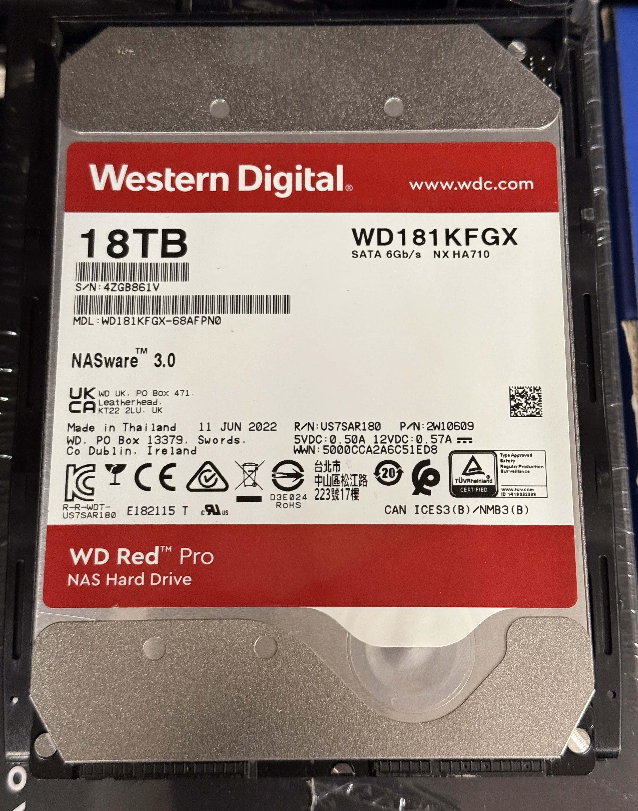

WDC WD181KFGX-68AFPN0 | 18 TB | 7,200 rpm
Serial: 4ZGB861V
Power-on hours: 34,797 | SMART: PASSED
Reallocated: 0 | Pending: 0 | Offline uncorrectable: 0
Temperature: 41 °C
Manufacturing date on label: 11 Jun 2022



**Full captured report*** (command: `smartctl -a -d sat /dev/sdc`; preserving the complete output supplied):

```text
smartctl 6.5 (build date Mar  2 2021) [x86_64-linux-4.4.59+] (local build)
Copyright (C) 2002-16, Bruce Allen, Christian Franke, www.smartmontools.org

=== START OF INFORMATION SECTION ===
Model Family:     Western Digital Red Pro
Device Model:     WDC WD181KFGX-68AFPN0
Serial Number:    4ZGB861V
LU WWN Device Id: 5 000cca 2a6c51ed8
Firmware Version: 83.00A83
User Capacity:    18,000,207,937,536 bytes [18.0 TB]
Sector Sizes:     512 bytes logical, 4096 bytes physical
Rotation Rate:    7200 rpm
Form Factor:      3.5 inches
Device is:        In smartctl database [for details use: -P show]
ATA Version is:   Unknown(0x0ffc) (unknown minor revision code: 0x009c)
SATA Version is:  SATA >3.2 (0x1ff), 6.0 Gb/s (current: 6.0 Gb/s)
Local Time is:    Mon Oct  5 10:32:41 2026 -05
SMART support is: Available - device has SMART capability.
SMART support is: Enabled

=== START OF READ SMART DATA SECTION ===
SMART overall-health self-assessment test result: PASSED

General SMART Values:
Offline data collection status:  (0x82) Offline data collection activity
                                        was completed without error.
Auto Offline Data Collection: Enabled.
Self-test execution status:      (   0) The previous self-test routine completed
                                        without error or no self-test has ever
                                        been run.
Total time to complete Offline data collection: (101) seconds.
Offline data collection capabilities: (0x5b) SMART execute Offline immediate.
Auto Offline Data Collection on/off support.
Suspend Offline collection upon new command.
Offline surface scan supported.
Self-test supported.
No Conveyance Self-test supported.
Selective Self-test supported.
SMART capabilities: (0x0003) Saves SMART data before entering power-saving mode.
Supports SMART auto save timer.
Error logging capability: (0x01) Error logging supported.
General Purpose Logging supported.
Short self-test routine recommended polling time: (2) minutes.
Extended self-test routine recommended polling time: (1796) minutes.
SCT capabilities: (0x003d) SCT Status supported.
SCT Error Recovery Control supported.
SCT Feature Control supported.
SCT Data Table supported.

SMART Attributes Data Structure revision number: 16
Vendor Specific SMART Attributes with Thresholds:
ID# ATTRIBUTE_NAME FLAG VALUE WORST THRESH TYPE UPDATED WHEN_FAILED RAW_VALUE
  1 Raw_Read_Error_Rate 0x000b 100 100 001 Pre-fail Always - 0
  2 Throughput_Performance 0x0004 135 135 054 Old_age Offline - 100
  3 Spin_Up_Time 0x0007 083 083 001 Pre-fail Always - 350 (Average 351)
  4 Start_Stop_Count 0x0012 100 100 000 Old_age Always - 248
  5 Reallocated_Sector_Ct 0x0033 100 100 001 Pre-fail Always - 0
  7 Seek_Error_Rate 0x000a 100 100 001 Old_age Always - 0
  8 Seek_Time_Performance 0x0004 140 140 020 Old_age Offline - 15
  9 Power_On_Hours 0x0012 096 096 000 Old_age Always - 34797
 10 Spin_Retry_Count 0x0012 100 100 001 Old_age Always - 0
 12 Power_Cycle_Count 0x0032 099 099 000 Old_age Always - 110
 22 Helium_Level 0x0023 100 100 025 Pre-fail Always - 100
192 Power-Off_Retract_Count 0x0032 100 100 000 Old_age Always - 2106
193 Load_Cycle_Count 0x0012 100 100 000 Old_age Always - 2106
194 Temperature_Celsius 0x0002 052 052 000 Old_age Always - 41 (Min/Max 20/53)
196 Reallocated_Event_Count 0x0032 100 100 000 Old_age Always - 0
197 Current_Pending_Sector 0x0022 100 100 000 Old_age Always - 0
198 Offline_Uncorrectable 0x0008 100 100 000 Old_age Offline - 0
199 UDMA_CRC_Error_Count 0x000a 100 100 000 Old_age Always - 0

SMART Error Log Version: 1
No Errors Logged

SMART Self-test log structure revision number 1
Num Test_Description Status Remaining LifeTime(hours) LBA_of_first_error
#1 Short offline Completed without error 00% 34594 -
#2 Short offline Completed without error 00% 33851 -
#3 Short offline Completed without error 00% 33108 -
#4 Short offline Completed without error 00% 32389 -
#5 Short offline Completed without error 00% 31646 -
#6 Short offline Completed without error 00% 31197 -
#7 Short offline Completed without error 00% 30926 -
#8 Extended offline Aborted by host 70% 30645 -
#9 Short offline Completed without error 00% 30183 -
#10 Short offline Completed without error 00% 29512 -
#11 Short offline Completed without error 00% 28768 -
#12 Short offline Completed without error 00% 28025 -
#13 Short offline Completed without error 00% 27306 -
#14 Short offline Completed without error 00% 26563 -
#15 Extended offline Aborted by host 70% 26281 -
#16 Short offline Completed without error 00% 25843 -
#17 Short offline Completed without error 00% 25101 -
#18 Short offline Completed without error 00% 24356 -
#19 Short offline Completed without error 00% 23638 -
#20 Short offline Completed without error 00% 22893 -
#21 Short offline Completed without error 00% 22175 -

SMART Selective self-test log data structure revision number 1
SPAN MIN_LBA MAX_LBA CURRENT_TEST_STATUS
1 0 0 Not_testing
2 0 0 Not_testing
3 0 0 Not_testing
4 0 0 Not_testing
5 0 0 Not_testing
Selective self-test flags (0x0):
After scanning selected spans, do NOT read-scan remainder of disk.
If Selective self-test is pending on power-up, resume after 0 minute delay.
```
